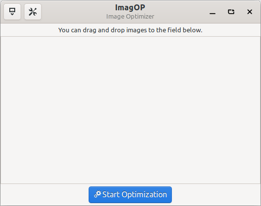
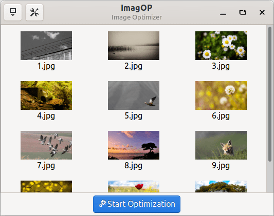
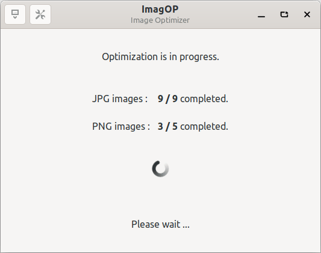

# ImagOP

ImagOP (image optimizer) is an application for lossy image file optimization.

Currently only png and jpg images are supported.
It uses pngquant and zopfli to optimize png images, python3-pil to optimize jpg images. 

You can add images to the application interface by drag and dropping them.
You can remove the pictures from the list in the interface by double-clicking them.

## Dependencies:

* This application is developed based on Python3 and GTK+ 3. Dependencies:
   - ```gir1.2-glib-2.0 gir1.2-gtk-3.0 gir1.2-notify-0.7 python3-pil pngquant zopfli```

## Run Application from Source

* Install dependencies :
    * ```gir1.2-glib-2.0 gir1.2-gtk-3.0 gir1.2-notify-0.7 python3-pil pngquant zopfli```
* Clone the repository :
    * ```git clone https://github.com/fthaltun/imagop.git ~/imagop```
* Run application :
    * ```python3 ~/imagop/src/main.py```

## Build deb package

* `sudo apt install devscripts git-buildpackage`
* `sudo mk-build-deps -ir`
* `gbp buildpackage --git-export-dir=/tmp/build/imagop -us -uc`

## Samples

> #### Original (png) (22.5 KB)
>
> 

> #### Optimized (png) (5.8 KB)
>
> 
---
> #### Original (png) (551.6 KB)
>
> 

> #### Optimized (png) (191.5 KB)
>
> 

---
> #### Original (jpg) (273.2 KB)
>
> 

> #### Optimized (jpg) (51.7 KB)
>
> 

## Screenshots






